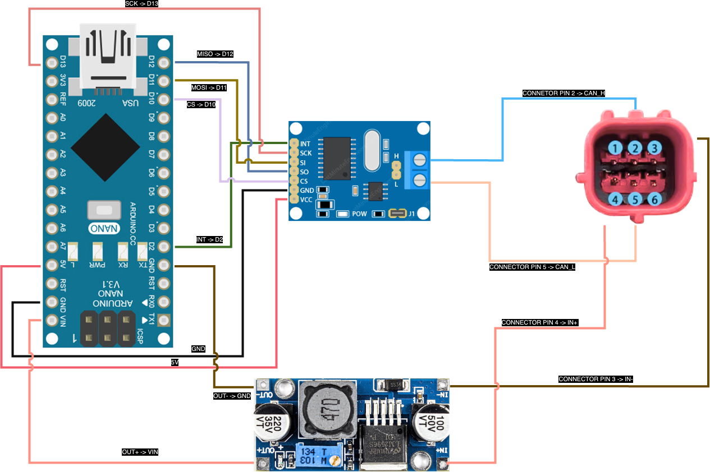

# Hardware Parts

- There are 2 options to create the dongle with:
1. Arduino Nano + Arduino modules
1. Custom Board (not fully finished as the PCB design is missing, electronics schema is done)

Both versions are described bellow:

## Arduino Modules

- Project was developed on Arduino Nano due to its small dimensions and the fact, that the project itself does not need a powerfull chip nor many of I/O pins.
- Used Arduino: [Link](https://store.arduino.cc/en-cz/products/arduino-nano) (It's possible to use even cheaper clones of Arduino Nano, tested on: [Link](https://www.gme.cz/v/1508606/nano-v30-r3-klon-vyvojovy-kit-arduino))

### Used Arduino modules

- [Step-down convertor (12V -> 7.6V/3A)](https://www.sparkfun.com/products/21255) &#8592; Converts battery voltage to voltage used by the components and controller. We want the output of the Step-Down to be between 7-8V, ideally 7.6V, as Arduino nano has its own voltage regulator. This will stabilize the voltage and current even if the battery will give more. 
- [MCP2551 CAN Bus module](https://www.elektor.com/products/can-module-mcp2515) &#8592; CAN-bus receiver + tranceiver module used to intercept and manipulate the communication on the CAN bus itself via the OBD connector

### Connection Diagram

## Custom Board

- The custom board schematic can be found here: [LINK](https://pro.easyeda.com/editor#id=2c3883b7eb234de3a114e8534fa8c1fe)
- It is an [easyEDA](https://easyeda.com/) project.

### What is working

- Schematic by itself is correct, tested on homemade PCB soldered by hand.

### What is missing

- Missing is the final version of the PCB as I had troubles with ordering the elements on the board. Anyone who knows how to properly order them is welcome to do so under one rule: THE BOARD NEEDS TO BE SHARED WITH EVERYONE.

### Electrical components

- [MCP2515](https://www.lcsc.com/product-detail/CAN-Controllers_Tokmas-MCP2515-I_C5250735.html) - The MCP2515 is a stand-alone CAN controller that interfaces with microcontrollers via SPI to enable communication over CAN networks, supporting data rates up to 1Mbps.

- [MCP2551](https://www.lcsc.com/product-detail/CAN-Transceivers_Microchip-Tech-MCP2551-E-SN_C635953.html) - The MCP2551 is a high-speed CAN transceiver that converts signals between a CAN controller and the CAN bus, supporting up to 1Mbps and providing EMI protection.

- [Atmega328P-AU](https://www.lcsc.com/product-detail/Microcontrollers--MCU-MPU-SOC-_Microchip-Tech-ATMEGA328P-AU_C14877.html) - The Atmega328P-AU is an 8-bit microcontroller with 32KB flash memory, used in embedded systems like Arduino, and supports up to 20MHz clock speeds with external crystals.

- [LM2575-5.0](https://www.lcsc.com/product-detail/DC-DC-Converters_Microchip-Tech-LM2576-5-0WU_C641104.html) - The LM2575-5.0 is a 5V fixed-output step-down voltage regulator capable of delivering up to 1A, with high efficiency and built-in protection features.

- [16MHz Crystal](https://www.lcsc.com/product-detail/Crystals_TAITIEN-Elec-XIHCELNANF-16MHZ_C295075.html) - A 16MHz Crystal generates a precise clock signal for microcontrollers, ensuring stable timing for applications like communication and embedded systems.

- Resistor's, capacitor's and inductor's values are in the schema on EasyEda (link above)
